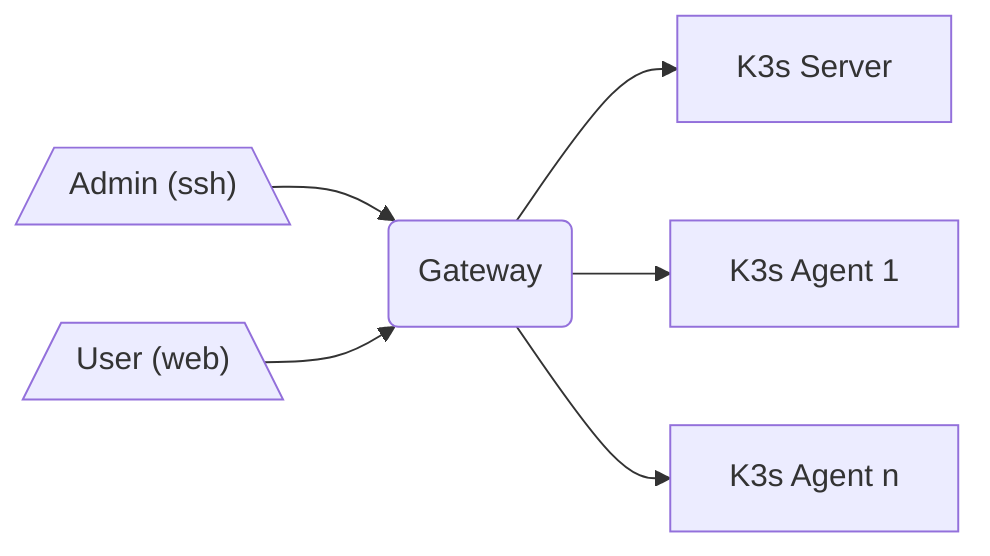

# terraform-azure-k3s-lab

## TL;DR:

- Do not use it in production environments. It's a quick lab.
- It's an IaaS lab foccussed on K3s (so no AKS, AzLoadBalancer...).
- Check the [Makefile](Makefile).

## Requirements

- Docker, in order to support DevContainers.
- VSCode with DevContainers plugin.

## How to

1. Initiate the DevContainer.

2. Authenticate to Azure using `az login` (and select proper subscription with `az account set --subscription <subscription>`).

3. Browse to the `terraform` folder, and check these variables before applying it:

  - `rg_name`: Shouldn't exist in your subscription.
  - `vm_prefix_name`: Shouldn't overlap with current VM's in your subscription.

4. Deploy it with `terraform apply`.

5. Connect to VMs and have fun (`ssh gw` / `ssh k3s0` / ...).

## Topology

- Server sufixed by (`-gw`) is the proxy for all traffic (`ssh` and `http/https`).
- Server sufixed by (`-k3s0`) is the K3s server.
- Any other server is a K3s agent.
